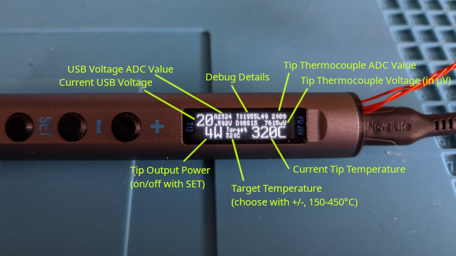
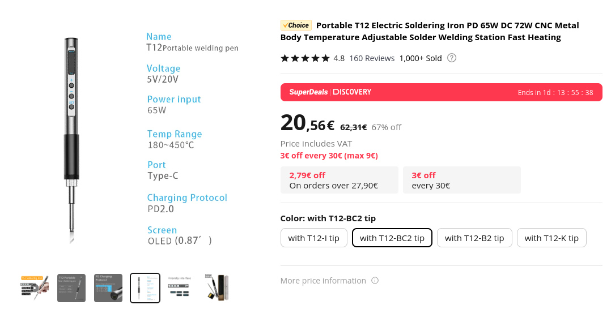
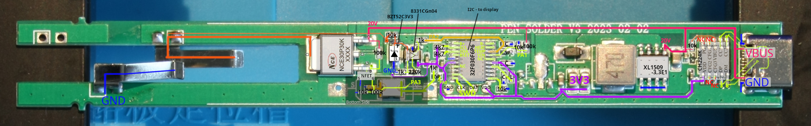

# T12 clone reverse engineering and replacement firmware

"I should have just bought a [Pinecil](https://wiki.pine64.org/wiki/Pinecil)."

## Replacement Firmware

Development WIP in [./test_fw](./test_fw).



Current state:

* all buttons work
* voltage measurement of soldering tip temperature and VBUS (from USB-PD) work
* display output works (it's connected to non-hardware-I2C pins, so we're bitbanging with [U8g2](https://github.com/olikraus/u8g2) with custom STM32 optimizations for around 170kHz I2C clock speed)
* heating on/off works (not yet regulated)
* no coordination between tip heating PWM and tip measurement, no temperature calculation yet
* resource usage: around 20/32kB flash, 1.4/4kB RAM

## "Pen Solder V3" Description

Its name is: *Portable T12 Electric Soldering Iron PD 65W DC 72W*. (T12 is just the name of this ubiquitous soldering tip though. Therefore I'm calling it by the label on its PCB.)



I [expected an STC8 uC](https://github.com/atc1441/ATC_stc_solder_iron) but got an STM32F030 clone instead. Which is arguably better.

Tracing the board layout:



Which leads to: [Reverse Engineered Schematic](./pen_solder_v3.pdf)

## Board Info

Label on case: T12

PCB:

```
PEN-SOLDER V3 2023-02-02
```

MCU: CHIPSEA F030F6P6
* https://www.st.com/resource/en/datasheet/stm32f030f4.pdf
* https://www.st.com/resource/en/reference_manual/rm0360-stm32f030x4x6x8xc-and-stm32f070x6xb-advanced-armbased-32bit-mcus-stmicroelectronics.pdf

Big P-MOSFET: NCE30P30K
* https://datasheet.lcsc.com/szlcsc/NCE30P30K_C130106.pdf

Small N-MOSFET driver: 72K
* Maybe: https://pdf1.alldatasheet.net/datasheet-pdf/view-marking/1085166/RUICHIPS/2N7002K.html

OpAmp: 8331CGn04
* https://datasheet.lcsc.com/lcsc/2206101816_Gainsil-GS8331-TR_C157712.pdf

Zener: W3
* Maybe: BZT52C3V3 https://pdf1.alldatasheet.net/datasheet-pdf/view-marking/58974/DIODES/BZT52C3V3.html

SMPS: XL1509-3.3E1
* https://www.xlsemi.com/datasheet/XL1509-EN.pdf

USB: CH224K
* https://datasheet.lcsc.com/lcsc/2204251615_WCH-Jiangsu-Qin-Heng-CH224K_C970725.pdf
* https://www.laskakit.cz/user/related_files/ch224ds1.pdf
* https://components101.com/ics/ch224k-usb-power-delivery-controller-ic

```console
$ st-info --probe 
Found 1 stlink programmers
  version:    V2J34S7
  serial:     ...
  flash:      32768 (pagesize: 1024)
  sram:       8192
  chipid:     0x0440
  descr:      F0xx
```

## Dumping Stock Firmware

```
st-flash --hot-plug read t12-f0.bin 0x8000000 32768
```

## "STM"32F030 Pinout

* 1: BOOT0 -> 10k to GND
* 4: NRST -> filtered VDD
* 6: PA0 -> not connected here, but optionally a non-populated part could connect it to some kind of SMD part (white square with 4 pads)
* 7: PA1 -> ADC: VIN measurement of 1/11*VBUS
* 8: PA2 -> ADC: Temperature measurement of soldering tip's thermocouple (through amplifier)
* 9: PA3 -> Heating enable for soldering tip
* 10: PA4 -> Button "Minus (-)", high active (10k pull-down to GND, button pulls to VDD)
* 11: PA5 -> Button "Plus (+)", high active
* 12: PA6 -> I2C SCL to display (4k7 to VDD)
* 13: PA7 -> I2C SDA to display (4k7 to VDD)
* 14: PB1 -> Button "Set", high active
* 17: PA9 -> looks like it's not connected to anything, used in stock firmware for display reset
* 19: PA13/SWDIO -> SWD header/pads
* 20: PA14/SWCLK -> SWD header/pads

## CH224K USB-PD Control

CFG1,2,3 pins are not connected to anything. Floating CFG1 means it will request VBUS=20V from USB power supply.
That's a bit concerning given that this means the P-MOSFET gets U_GS=20V (or more) and that's already its U_GSmax.

Too bad those pins aren't connected to the uC.

## OpAmp

* Used as non-inverting amplifier, 221x gain
* Output connected to PA2 through passive low-pass (I wonder how well it works with the long line between R and C)
* Input connected to T12 soldering tip pin A (the last ring), (tip pin B (the ring between A and Earth) is connected to GND)
* Zener diode clamps input to 3.3V max.
* Input range should be 14.9 mV max. assuming the output is 3.3V max.
* I wonder how noisy the temperature measurement is


